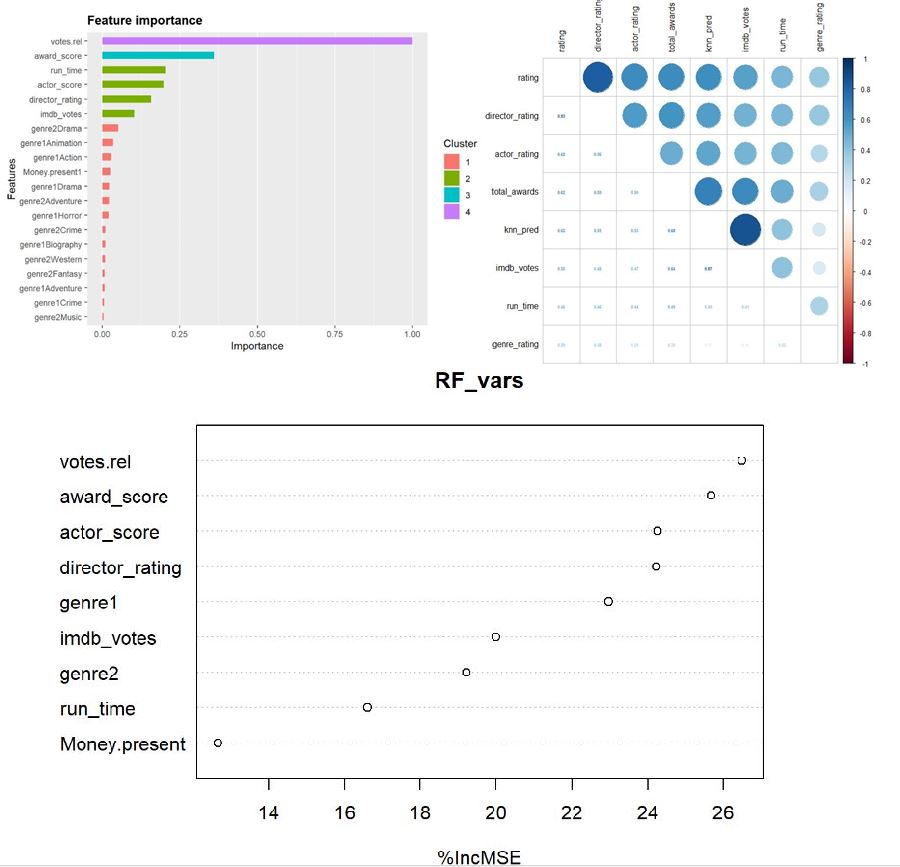

# Callum Thickett - Projects
A collection of my latest data analytics and data science projects.

# [Multiclass Classification of Authors using written text to understand how personality is captured in the written medium](https://github.com/thickett/data-science-projects/tree/main/Author_identity_prediction)

## Project Overview

* **Selenium** and **Scrapy** python packages used to asynchronously scrape dynamic web pages.
* Dozens of Custom functions for data cleaning and feature engineering
* NLP techniques such as **TF-IDF**, **LDA** were used for the purpose of feature engineering
* A veriety of models compared using several performance metrics such as epoch-performance curves time-to-fit curves, f1-scores
* **Hyper-opt** used for hyper-parameter optimisation.

# [Creating an efficient, scalable and generalizable machine learning pipeline for the prediction of molecular energies using simple atomic, and structural features.](https://github.com/thickett/data-science-projects/blob/main/Molecular%20Energy%20predictions/README.MD)

* Utalised Hadoop's HDFS for the effective distributed storage of large amounts of chemical data, and to ensure scaling of the process is possible from a storage persepective.
* Used pyspark to clean and feature engineer complex chemical data
* Utalised cacheing to maximise the effective use of in-memory storage.
* Used the MLlib Library to build efficent, generalizble ML workflows.
* Made use of Hyper-opt's asynchronous capabilities to efficently optimise hyper-parameters.

## [IMDb_Movie ratings predictions using elastic net regression, XGboost, KNN and more ](https://github.com/thickett/IMDB_webscraping_analysis)

## Project Overview
An all encompassing project where I scrape, clean, manipulate and engineer data to create a predictive model that can successfully predict movie IMDB ratings based off of a number of predictor variables. 

The project was split into four main sections:

### 1) Web Scraping 
* Created from scratch a web scraper in R that could:
  * Successfully scrape data from multiple pages and subpages. 
  * Collate the collected data into a tidy dataframe with thousands on records.
* Produced several web scraperers to solve data cleaning problems. 

### 2) Data Cleaning
* Extracted important information from complex strings to create tidy, informative variables using custom made functions.
* Feature engineered new variables to present the data in a more meaningful way.
* Made decisions on how to correctly navigate missing and incorrect data.
* Ensured data integrity was maintained throughout. 

 
 
### 3) Exploratory analysis and feature engineering 
 * Created compelling data vizulizations to outline the scope of the data.
 * Identified key trends and relationships.
 * Feature engineered several new variables  all of which played a pivital role in the success of the predictive model.
 * Normalized the data to ensure distance based, and gradient decent based algorithims performed optimally.
 * Utalised KNN regression to add localised structural information of the data, and to create a new predictor variable.
 
 
### 4) Model building and predictions.
 * Produced a predictive model that made use of mutliple confounding regression algorithims such as:
   * Elastic net regression.
   * Random forests.
   * XGboost regression trees.
 * Took measures to ensure the predictive model worked well on un-seen data by:
 * Making use of holdout datasets.
 * K-fold cross validation.

## [Google Analytics Capstone Project: Improving The Subscriber Count Of A Bikeshare Company.](https://github.com/thickett/Capstone-Project-improving-a-bikeshare-company)
### Project overview:
 * Compiled data from multiple sources using SQL. 
 * Cleaned millions of rows of Data using both SQL and R.
 * Utilised R to manipulate and analyse the data.
 * Created compelling data visualizations with R to present findings.
 * Designed a mock report for my findings.
 
 
 

